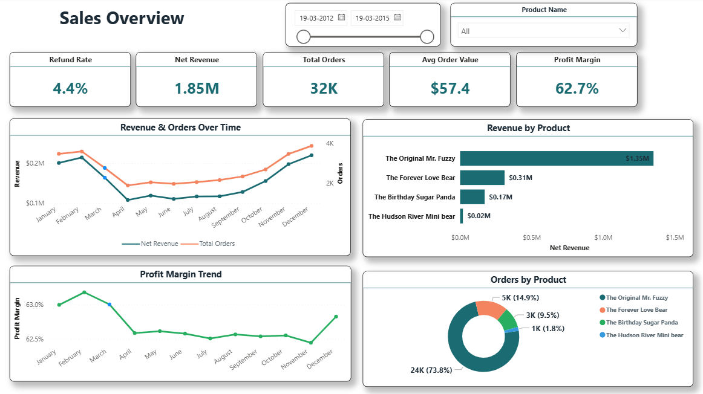
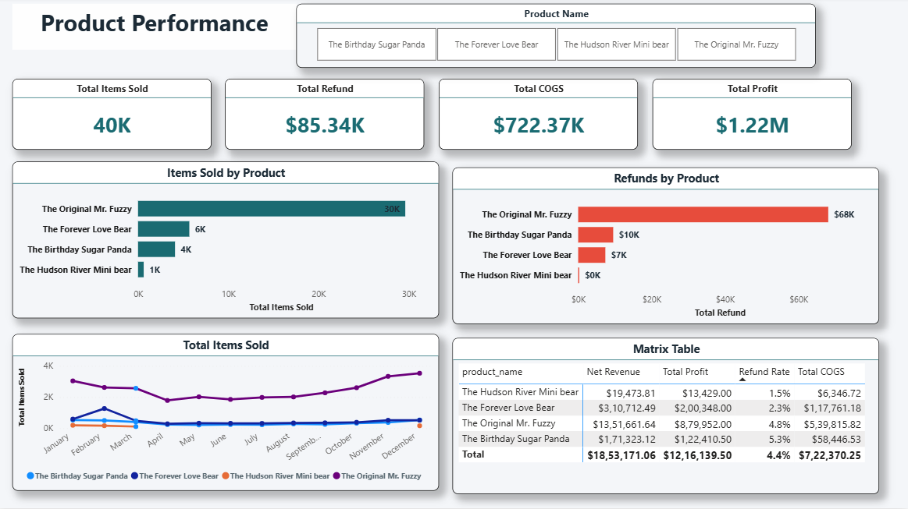
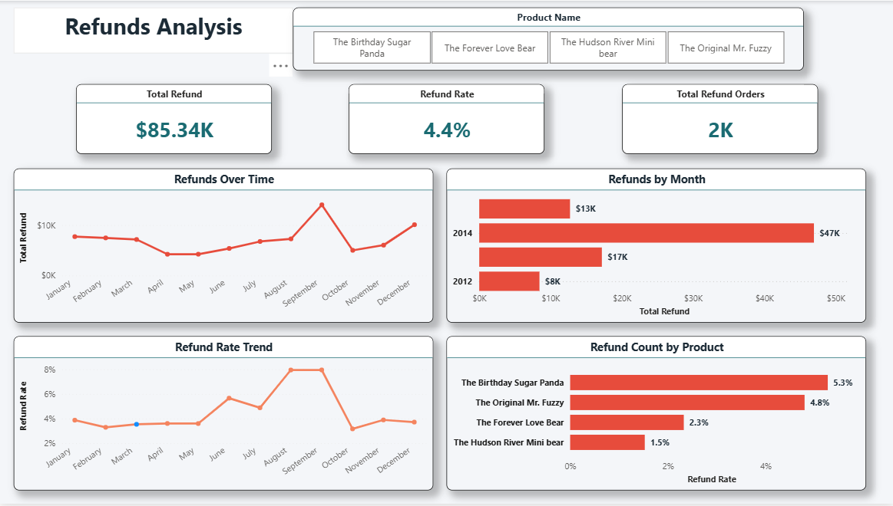

# E-Commerce Sales & Web Analytics Project

## Project Overview
This end-to-end data analytics project analyzes an e-commerce business using SQL and Power BI. The project answers 19 key business questions through SQL queries and visualizes insights through a 4-page interactive Power BI dashboard covering sales performance, web traffic acquisition, product performance, and refunds analysis.

## Tools & Technologies
- **SQL (MySQL)** — Business analysis & data extraction
- **Power BI** — Interactive dashboard & data visualization
- **DAX** — Custom KPI measures & calculations

## Dataset
- 6 related tables: `orders`, `order_items`, `order_item_refunds`, `products`, `website_sessions`, `website_pageviews`
- 32,000+ orders | 473K+ website sessions
- Date range: 2012 – 2015

---

## Dashboard Preview

### 📊 Page 1 — Sales Overview


### 🌐 Page 2 — Traffic & Acquisition


### 📦 Page 3 — Product Performance


### 🔄 Page 4 — Refunds Analysis


---

## SQL Business Questions Answered

| # | Business Question |
|---|---|
| 1 | Total revenue generated |
| 2 | Monthly revenue trend & running total |
| 3 | Total orders and items sold |
| 4 | Average order value (AOV) |
| 5 | Top 10 products by revenue |
| 6 | Overall refund rate |
| 7 | Monthly profit trend |
| 8 | Highest profit margin product |
| 9 | Top traffic source by revenue |
| 10 | Conversion rate by UTM source |
| 11 | New vs repeat customer revenue |
| 12 | Revenue by device type |
| 13 | Best marketing campaign |
| 14 | Customer lifetime value (LTV) |
| 15 | Cohort analysis (retention base) |
| 16 | Funnel analysis |
| 17 | Repeat purchase rate |
| 18 | Revenue lost due to refunds |
| 19 | Top 3 products contribution % |

---

## Power BI Dashboard Pages
1. **Sales Overview** — Revenue, orders, profit margin, AOV KPIs
2. **Traffic & Acquisition** — Sessions, conversion rate, UTM source
3. **Product Performance** — Items sold, refunds, product comparison
4. **Refunds Analysis** — Refund trends, rates, and product breakdown

---

## Key Insights
- 🏆 The Original Mr. Fuzzy contributed **$1.35M revenue** (73% of total orders)
- 🔍 **gsearch nonbrand** was the top acquisition channel
- 📈 **6.83% overall conversion rate** across 473K sessions
- 💻 **69.2% desktop** vs 30.8% mobile traffic split
- ⚠️ Birthday Sugar Panda had highest refund rate at **5.3%**
- 📊 Top 3 products contributed majority of total revenue

---

## Repository Structure
```
ecommerce-sales-web-analytics/
├── Sales_Overview_Dashboard.png
├── Traffic_&_Acquisition_Dashboard.png
├── Product_Performance_Dashboard.png
├── Refund_Analysis_Dashboard.png
├── bussiness_answers_using_sql.sql
├── SQL_table_creation_and_build_relation.sql
├── Maven+Fuzzy+Factory.zip
└── README.md
```

---

## How to Use
1. Extract `Maven+Fuzzy+Factory.zip` to get the raw data
2. Run `SQL_table_creation_and_build_relation.sql` to create tables
3. Run `bussiness_answers_using_sql.sql` for business analysis queries
4. Open the Power BI `.pbix` file in Power BI Desktop for dashboard
